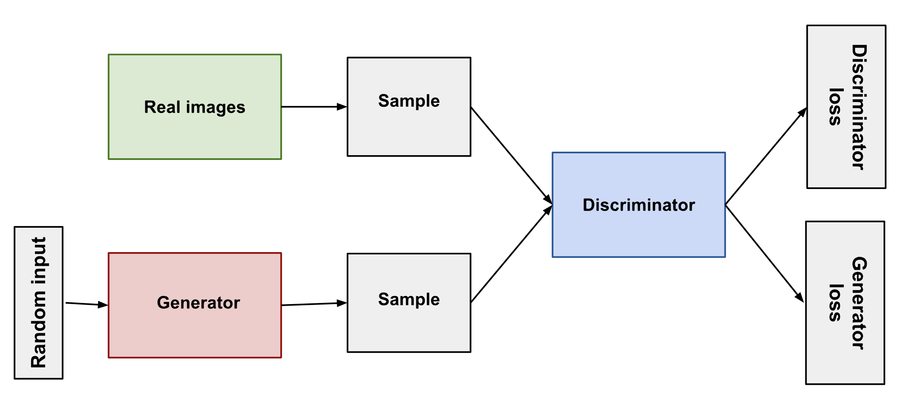

# GAN: Generative Adversarial Networks

from [developers.google.com/machine-learning/gan](https://developers.google.com/machine-learning/gan/gan_structure)

The **generator** learns to generate plausible data. The generated instances become negative training examples for the discriminator.

The **discriminator** learns to distinguish the generator's fake data from real data. The discriminator penalizes the generator for producing implausible results.

## Optimization
from [www.youtube.com/watch?v=J1aG12dLo4I&ab_channel=WelcomeAIOverlords](https://www.youtube.com/watch?v=J1aG12dLo4I&ab_channel=WelcomeAIOverlords)

Generator outputs fake data from noise input. The fake data has the same dimensions are the real data. 

The input to the discriminator is either the fake data or the real data. It outputs a probability of the data being real. 

$D(G(z))$  denotes the output probability of the discriminator with fake data input, and $D(x)$ denotes the output with real data. 

Note that the adversarial framework takes the problem from unsupervised (no labels) to supervised (real vs fake). 

The cost we aim to optimize is the following:

$V(D,G) = E_x[\log(D(x))] + E_z(\log(1-D(G(z))))$

First term: $E_x[\log(D(x))]$
- the discriminators prediction on the real data: expectation of the output when input is form the real data distribution i.e. the average of the predictions, the discriminator should push this value higher to increase confidence that the real value is real. 
- the generator doesn't contribute to this term

Second term: $E_z(\log(1-D(G(z))))$
- the discriminators prediction on the fake data: expectation of the output when input is form the fake data distribution i.e. the average again, the optimizer wants the inverse of this value to be higher, indicating that the fake samples are in fact false (lower probability)
- the generator wants to minimize this term to increase the probability of the fake data being predicted as real

The optimization objective allows us to find a D that maximizes the cost function to discriminate between fake and real data with higher confidence, and allows us to find a G that minimizes the cost function to produce higher quality fake data that can deceive the discriminator.  

$\displaystyle\min_{G} \max_{D} V(D,G) = E_x[\log(D(x))] + E_z(\log(1-D(G(z))))$

